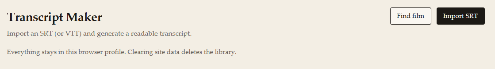
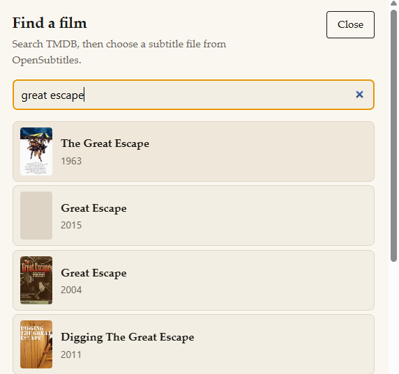
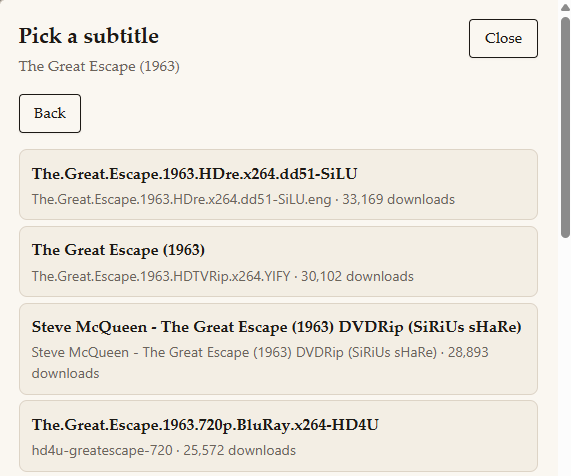
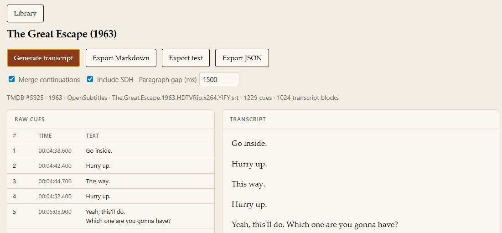

# Transcript Maker

Turn movie subtitles into a clean, readable transcript you can highlight and export. Everything runs in your browser; your library stays on your machine.

See [ROADMAP.md](ROADMAP.md) for what's planned next.

---

## User guide

### What you can do

- **Import** an SRT or VTT file you already have
- **Find a film** and download a matching subtitle from OpenSubtitles
- **Generate** a readable transcript from raw subtitle cues
- **Export** Markdown (for Readwise), plain text, or timed JSON

Your works are saved automatically in this browser profile. Clearing site data for this app deletes the library.

### Library screen



From the library you can:

- **Import SRT** — open a `.srt` or `.vtt` from your computer
- **Find film** — search TMDB, then pick a subtitle from OpenSubtitles
- Open any saved work to continue where you left off
- **Delete** a work you no longer need

### Option A — Import a subtitle file

Best when you already downloaded subtitles elsewhere.

1. Click **Import SRT** and choose your file.
2. Open the work from the library.
3. Skim **Raw cues** on the left to confirm the import looks right.
4. Click **Generate transcript**.
5. Read the transcript on the right, then export if you like.

### Option B — Find a film and download subtitles

Best when you want the app to fetch subtitles for you.

1. Click **Find film**.
2. Search by title (e.g. *The Great Escape*) and pick the correct TMDB result.
3. On the subtitle list, pick a file — higher download counts are usually safer bets.
4. The app imports the file and opens the work.
5. Click **Generate transcript**, then export.





If no subtitles appear, use **Import SRT** with a file from [OpenSubtitles](https://www.opensubtitles.com) instead.

**Keyboard:** In either list, press **↓** to highlight a row, **↑** to move back, **Enter** to select. On the film step, keep focus in the search box while using the arrows.

### Work screen



| Area | What it does |
| --- | --- |
| **Title** | Editable; defaults to the filename or film name |
| **Generate transcript** | Builds the reading copy from raw cues (disabled until cues exist) |
| **Export Markdown / text / JSON** | Download files; Markdown is best for Readwise Reader |
| **Merge continuations** | Join subtitle lines that split mid-sentence |
| **Include SDH** | Keep stage-direction lines like `[door slams]` |
| **Paragraph gap (ms)** | Don't merge cues separated by a long pause (default 1500) |
| **Raw cues** | Source subtitles with timestamps — never edited by cleaning |
| **Transcript** | Reading copy; regenerate anytime after changing options |

**Tip:** After changing options, click **Generate transcript** again. The raw cues stay unchanged.

### Exporting to Readwise

1. Generate a transcript.
2. Click **Export Markdown**.
3. Import the `.md` file into [Readwise Reader](https://readwise.io/read) (or paste the contents).

Speaker dashes (`- Hello`) are stripped in Markdown export so Readwise doesn't treat them as bullet lists.

### Data and privacy

- Subtitles are parsed in your browser.
- The library lives in **IndexedDB** for this browser profile only.
- Movie/subtitle search goes through a local proxy using your API keys; subtitle files are not uploaded to our servers (there are no servers — it's all local dev for now).

---

## Developer guide

### Prerequisites

- [Node.js](https://nodejs.org/) 18 or newer
- npm (included with Node)

### Install

```bash
npm install
cd proxy && npm install && cd ..
```

### API keys

Movie search and subtitle download need keys in `proxy/.dev.vars`. Step-by-step setup: [docs/API-KEYS.md](docs/API-KEYS.md).

```bash
cd proxy
cp .dev.vars.example .dev.vars
# Edit .dev.vars — at minimum:
#   TMDB_API_KEY=...
#   OPENSUBTITLES_API_KEY=...
#   OPENSUBTITLES_USERNAME=...   # required for subtitle download
#   OPENSUBTITLES_PASSWORD=...
```

Restart the proxy after editing `.dev.vars`.

### Run locally

**Recommended — one command:**

```bash
npm run dev:all
```

**Or two terminals** (both must stay running):

```bash
# Terminal 1 — API proxy (port 8787)
npm run dev:proxy

# Terminal 2 — app
npm run dev
```

Open the URL Vite prints (usually `http://localhost:5173`).

**Sanity checks** (use Chrome, not the Cursor embedded browser):

- `http://localhost:8787/api/health` → `{"ok":true,"tmdb":true,"opensubtitles":{...}}`
- `http://localhost:5173/api/health` → same JSON (confirms Vite proxy is active)

If search fails with `ECONNREFUSED 127.0.0.1:8787`, the proxy isn't running. If you get HTML instead of JSON on port 5173, restart the Vite dev server. See troubleshooting in [docs/API-KEYS.md](docs/API-KEYS.md).

### Scripts

| Command | What it does |
| --- | --- |
| `npm run dev:all` | Start proxy + app together (recommended) |
| `npm run dev` | Start the Vite dev server only |
| `npm run dev:proxy` | Start the API proxy only |
| `npm run build` | Typecheck and build static files to `dist/` |
| `npm run preview` | Serve the production build locally |
| `npm test` | Run unit tests |
| `npm run test:watch` | Run tests in watch mode |

### Project layout

```
src/
  app/              entry point, root component, styles
  components/       Library and work screens
  db/               IndexedDB (Dexie)
  features/
    search/         Find film wizard (TMDB + OpenSubtitles)
    works/          import subtitle files
  lib/
    api/            calls to the proxy
    subtitle/       parse SRT/VTT, clean into transcript blocks
    export/         Markdown, text, and JSON export
  types/            shared TypeScript types
proxy/              Cloudflare Worker — TMDB + OpenSubtitles
docs/               API key setup, plans
```

More detail: [ARCHITECTURE.md](ARCHITECTURE.md).

### Deploy

`npm run build` produces a static site in `dist/`. Deploy the `proxy/` worker separately (e.g. Cloudflare Workers) and set `VITE_API_BASE_URL` to its URL at build time.

Phased plan and security notes: [docs/PLAN-deployment.md](docs/PLAN-deployment.md).
