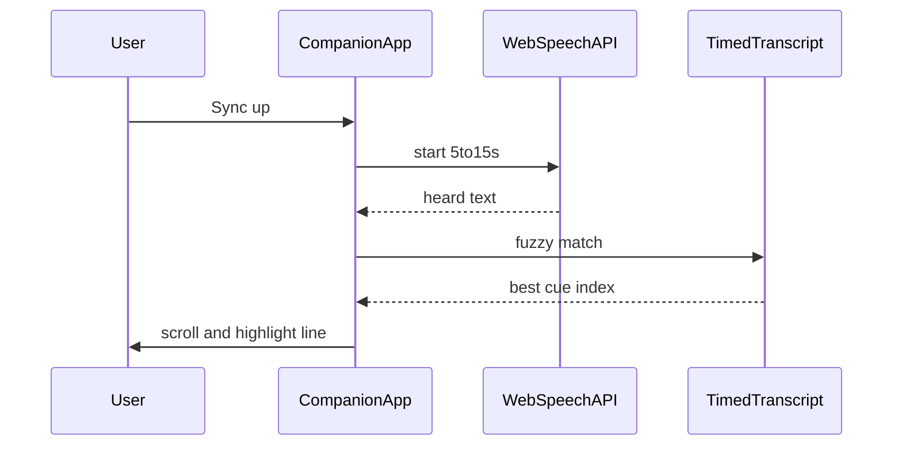

# Portable build + companion watch mode

Part A (standalone HTML) is implemented. Part B (highlights + Sync up) is not started.

See also: [PLAN-deployment.md](PLAN-deployment.md), [ROADMAP.md](../ROADMAP.md), [ARCHITECTURE.md](../ARCHITECTURE.md).

---

## Part A — Standalone HTML (Miles middle-ground)

Ship the app as **one HTML file** you can open without hosting. Covers import → generate → export; does **not** replace deployment for **Find film**.

### Why

- No server, no Cloudflare account, no cold starts.
- Easy to email, Dropbox, or USB to another machine.
- Fits a personal tool better than a public deploy when the scary part is the API proxy.

### Approach

Uses [`vite-plugin-singlefile`](https://github.com/richardtallent/vite-plugin-singlefile) via [vite.single.config.ts](../vite.single.config.ts).

```bash
npm run build:single
# → dist/index.html (open via double-click / file://)
```

Root Vite has a single HTML entry and no History API routing, so the usual `file://` SPA limitations mostly don't apply. IndexedDB and File APIs work in modern Chrome/Edge/Firefox for this pattern.

**Find film** is disabled when `file://` or `/api/health` fails ([useApiAvailability.ts](../src/features/search/useApiAvailability.ts)).

### What works vs what doesn't

| Feature | Standalone HTML |
| --- | --- |
| Import SRT / VTT | Works |
| Generate transcript | Works |
| Export MD / text / JSON | Works |
| Library (IndexedDB) | Works, but origin is tied to the file path — **moving or renaming** the HTML can look like a new site with an empty library |
| **Find film** | Disabled in portable build; needs [proxy](../proxy/) + CORS for `http://localhost` |
| Bundle size | One fat HTML (React + Dexie); fine for personal use |

### Placement vs deployment

| Phase | Goal |
| --- | --- |
| 0 | Local `npm run dev:all` |
| **0.5** | **`build:single` — core loop without hosting** *(done)* |
| 1 | Static app on Cloudflare (import + transcript; Find film optional) |
| 2 | Authenticated proxy for Find film in production |

### Implementation checklist

- [x] Add `vite-plugin-singlefile` and `build:single` script
- [x] Disable Find film when `/api/health` fails or `file://`
- [x] Note IndexedDB path-origin caveat in README
- [ ] Sanity: open `file://` HTML → import SRT → generate → export (manual)

---

## Part B — Companion: in-app highlight + Sync up

Complementary to Activity 2 (video file in the browser). Use case: you're watching **elsewhere** (TV / projector) and want the transcript to catch up and support highlighting without fighting Readwise scroll position.

Treat as a **companion mode** (same repo or thin separate app) that consumes the same Work / cues data (or imported MD / timed JSON).

### B1 — Readwise API

Two useful surfaces:

1. **Classic Readwise API** — `POST https://readwise.io/api/v2/highlights/`  
   Send highlight text + title/author (film name). Best for “select in our app → push to Readwise.”

2. **Reader API** — `POST https://readwise.io/api/v3/save/`  
   Push the full transcript as a document (`html` or `markdown` + synthetic `url`, e.g. `https://transcript-maker.local#tmdb-5925`). Creating Reader highlights later needs exact HTML fragment matching (fiddlier).

Docs: [Readwise API](https://readwise.io/api_deets), [Reader API](https://readwise.io/reader_api).

**Recommended product shape:**

- Highlight **in our app** (primary UX, especially with Sync up).
- On demand: **Push to Readwise** (v2 highlights) and/or **Save transcript to Reader** (v3 save).
- Token: user pastes a Readwise access token locally (or via proxy later) — same secret pattern as TMDB. **Do not** bake the token into a public standalone HTML.

This upgrades the current follow-on (“export Markdown and paste”) to “push from app.”

### B2 — Sync up (mic burst, not continuous)

**Don't run always-on listening.** Continuous STT is heavy on CPU/battery, privacy-sensitive (Chrome often sends audio to cloud unless on-device is available), and noisy with TV + room mic.

**Burst locate flow:**

1. User taps **Sync up**.
2. Mic listens ~5–15 seconds (`SpeechRecognition` / Web Speech API; prefer `processLocally` where supported).
3. Stop automatically.
4. Fuzzy-match heard text against cue / transcript strings (sliding window + score; Fuse.js or DIY n-grams).
5. Scroll / highlight the best-matching block; user confirms or retries.



**Why burst is enough:** matching needs a distinctive phrase, not continuous forced alignment.

**Hard parts (expect iteration):**

- Far-field TV dialogue vs room mic quality
- Music / SFX / overlapping speech
- Subtitle wording ≠ spoken wording (SDH, paraphrases)
- Ambiguous repeats (“Hello?” many times) — bias toward last known position / recent context

### Relation to Activity 2

| Mode | Sync source | Needs movie file? |
| --- | --- | --- |
| **Sync up** (this plan) | Ambient audio via mic burst | No |
| **Activity 2** viewer | Local video playhead | Yes |

Both share the timed cue model in `src/types`. Sync up unblocks “lost my place while watching elsewhere” without waiting for easy movie-file access.

### Implementation checklist (when we build it)

- [ ] In-app text selection → local highlight store on the Work
- [ ] Settings: Readwise access token (local only)
- [ ] Push selected highlights via v2 API; optional “Save transcript to Reader” via v3
- [ ] Sync up button: burst STT → fuzzy match → scroll to cue
- [ ] Privacy copy: listening is on-demand; note cloud vs on-device STT
- [ ] Prefer separate “watch mode” UI so import/search stays uncluttered

---

## Product placement

| Idea | Where | Effort / value |
| --- | --- | --- |
| Standalone HTML build | Same repo; `npm run build:single` | Done — Find film disabled offline |
| In-app highlight + Readwise push | Same app or thin companion | Unlocks highlighting without MD round-trip |
| Sync up (mic burst) | Companion / watch mode | Solves lost place without movie file |
| Activity 2 video sync | Later, when files are easy | Precise sync when media is in-browser |

---

## Suggested sequence

```
Now
  Local app + MD export to Readwise
  Part A — build:single (import / generate / export only)  [done]

When highlighting-in-place matters
  Part B1 — in-app highlights + Readwise / Reader push

When watching elsewhere and losing place
  Part B2 — Sync up burst mic match

When movie files are easy
  Activity 2 — video + transcript playhead sync
```
