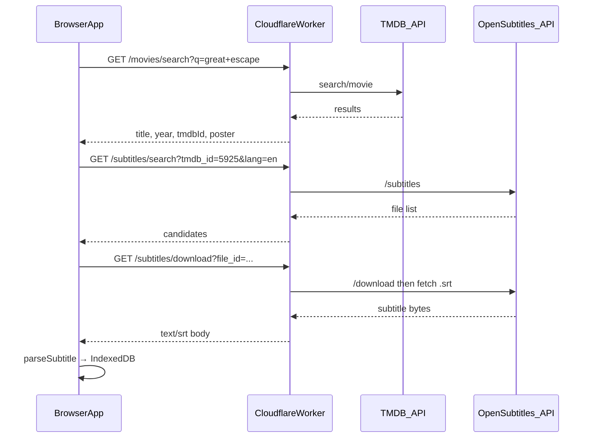

# Activity 1.2 — Movie search + subtitle download

Find a film, pick a subtitle file, import it through the same pipeline as manual upload. Manual import stays forever.

## Problem

The browser cannot call OpenSubtitles (or most subtitle sites) directly: CORS blocks cross-origin fetches, and downloads require API auth. TMDB is callable from the client but exposes your API key unless proxied.

**Solution:** keep the React app static; add a small **proxy** (Cloudflare Worker recommended) that holds secrets and forwards API calls.



## APIs

### TMDB (movie identity)

- Sign up: https://www.themoviedb.org/settings/api (free)
- Search: `GET https://api.themoviedb.org/3/search/movie?query=...`
- Returns: `id`, `title`, `release_date`, `poster_path`
- Rate limit: generous for personal use

### OpenSubtitles (subtitle search + download)

- Sign up: https://www.opensubtitles.com/en/consumers (free API key)
- Base: `https://api.opensubtitles.com/api/v1`
- Required headers: `Api-Key`, `User-Agent` (app name + version)
- Search: `GET /subtitles?tmdb_id={id}&languages=en`
- Download: `POST /download` with `{ file_id }` → returns a short-lived link; proxy fetches the `.srt` and returns body to the app
- Note: OpenSubtitles may require a logged-in user token for downloads on some tiers — proxy handles login once and caches token

## Proxy layout

```
proxy/
  src/
    index.ts          # router
    tmdb.ts
    opensubtitles.ts
  wrangler.toml
  package.json
```

### Endpoints

| Method | Path | Purpose |
| --- | --- | --- |
| `GET` | `/api/movies/search?q=` | TMDB movie search |
| `GET` | `/api/subtitles/search?tmdb_id=&lang=en` | List subtitle files for a film |
| `GET` | `/api/subtitles/download?file_id=` | Return `.srt` file contents |

### Secrets (Worker env, never in the client)

- `TMDB_API_KEY`
- `OPENSUBTITLES_API_KEY`
- Optional: `OPENSUBTITLES_USERNAME` / `OPENSUBTITLES_PASSWORD` if download requires user login

### Local dev

- `wrangler dev` on port 8787
- Vite `server.proxy`: `/api` → `http://localhost:8787`
- Production: same Worker on a subdomain; `VITE_API_BASE_URL` in the app build

## App changes

### Data model (`src/types/index.ts`)

```ts
type FilmIdentity = {
  tmdbId: number;
  title: string;
  year?: number;
  posterUrl?: string;
};

type SubtitleSource = {
  provider: "opensubtitles" | "manual";
  fileId?: string;
  language?: string;
  release?: string;
};

type Work = {
  // existing fields…
  film?: FilmIdentity | null;
  subtitleSource?: SubtitleSource | null;
};
```

Dexie schema bump to v2 (additive fields; existing works stay valid).

### New modules

```
src/
  features/
    search/
      SearchWizard.tsx       # modal: movie → subtitles → import
      useMovieSearch.ts
      useSubtitleSearch.ts
  lib/
    api/
      client.ts              # fetch wrapper, base URL from env
      movies.ts
      subtitles.ts
```

### UI flow

**Library screen** — two import paths:

1. **Import SRT** (existing file picker)
2. **Find subtitles** → opens `SearchWizard`

**SearchWizard steps:**

1. **Search movie** — text input, debounced TMDB search, results list (poster thumbnail, title, year). Pick one.
2. **Pick subtitle** — language dropdown (default `en`), list of files: release name, hearing-impaired badge, download count, uploader. Sort by downloads / match score.
3. **Import** — download via proxy, run `parseSubtitle`, save `Work` with `film` + `subtitleSource` metadata. Navigate to work screen.

**Work screen** — if `work.film` is set, show film title + year under the editable title (instead of only the raw filename).

**Fallback** — on search/download failure, show link: “Open on OpenSubtitles” (`https://www.opensubtitles.com/en/search/sublanguageid-eng/moviename-{title}`) and remind user they can **Import SRT** manually.

## Implementation phases

### Phase A — Proxy skeleton + TMDB search (no download yet)

- [x] Scaffold `proxy/` with Wrangler
- [x] `GET /api/movies/search`
- [x] Vite dev proxy + `.dev.vars.example`
- [x] `SearchWizard` step 1 only; selecting a film stores metadata on a new work

**Done when:** you can search “Great Escape”, see results, pick one.

### Phase B — OpenSubtitles search + download

- [ ] OpenSubtitles auth helper in proxy (API key + optional login)
- [ ] `GET /api/subtitles/search`
- [ ] `GET /api/subtitles/download` → returns SRT text
- [ ] Wire wizard step 2 → import through existing `importWork` path
- [ ] Error handling + loading states

**Done when:** pick film → pick subtitle → land on work screen with parsed cues (same as manual import).

### Phase C — Polish

- [ ] Language picker (`en`, `es`, …)
- [ ] Filter: hearing impaired vs standard
- [ ] Show `film` on library cards
- [ ] Deploy Worker; document production env vars in README
- [ ] Optional: hide TMDB key behind proxy too (if not already)

## Out of scope for this slice

- TV episodes (TMDB `search/tv` — later)
- Storing API keys in the browser
- Scraping non-API subtitle websites
- Auto-generating transcript after import (user still clicks **Generate transcript**)

## Open decisions

1. **Proxy host:** Cloudflare Workers (recommended) vs a tiny Express server you run locally — Workers scale to hosted static app with zero ops.
2. **TMDB in browser vs proxy:** start with TMDB in proxy only (one place for secrets); can optimize later.
3. **Default language:** `en` hardcoded first; picker in Phase C.

## Manual import

Unchanged. Search is convenience; file picker remains on the library screen and works offline.
